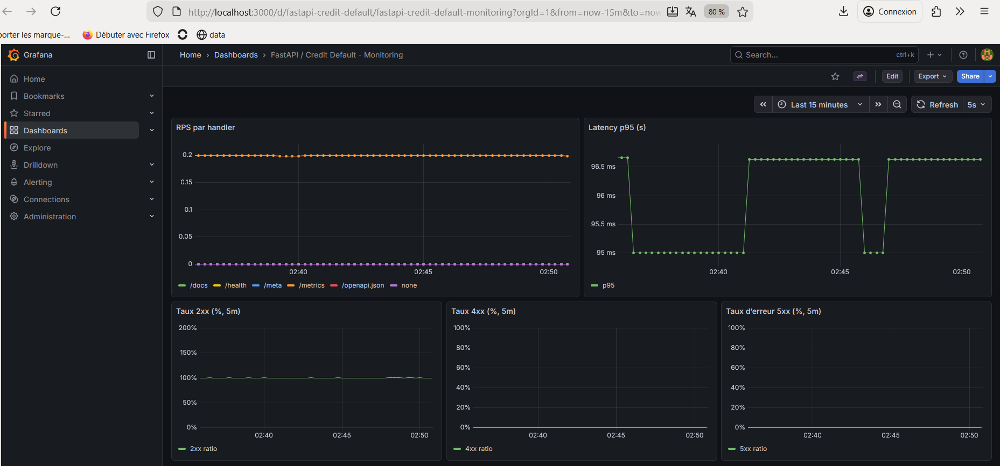
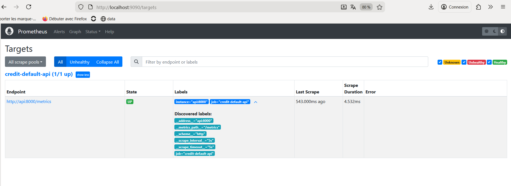
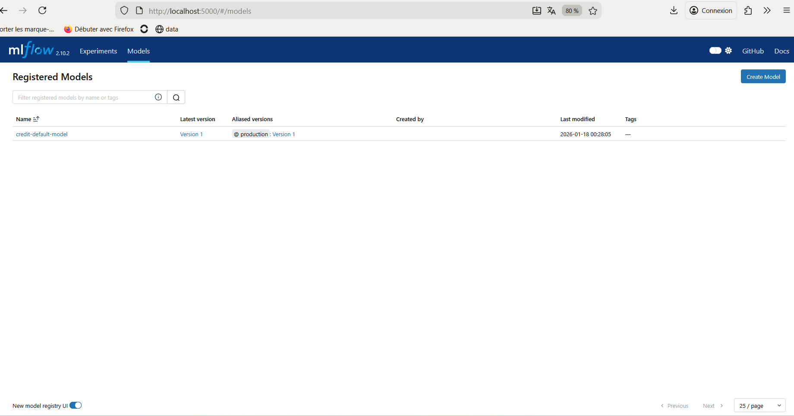
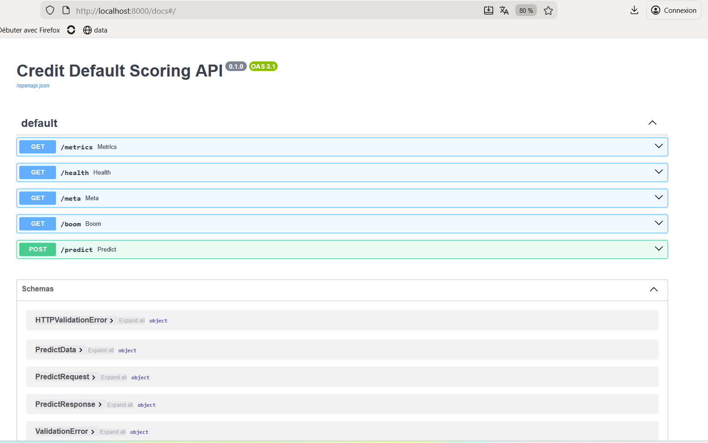

# Credit Default MLOps Pipeline

Pipeline MLOps pour la prédiction du défaut de paiement intégrant :
- entraînement et évaluation du modèle
- MLflow Tracking et Model Registry
- API FastAPI containerisée (serving et métriques Prometheus)
- CI GitHub Actions (format, lint, tests, build Docker)
- Monitoring Prometheus & Grafana (dashboards auto-provisionnés)


---

## Objectif

Montrer un système MLOps production-ready couvrant tout le cycle de vie :
- *data → entraînement → tracking → registry*
- *déploiement API*
- *observabilité (SLO/latence/erreurs)*
- *qualité (lint/tests) + reproductibilité (Docker Compose)*

---

## Stack et composants

- FastAPI (serving) + `prometheus-fastapi-instrumentator` → métriques sur `GET /metrics`
- MLflow (v2.10.2) → tracking + registry
- MinIO (S3) → stockage des artefacts MLflow (`s3://mlflow/`)
- PostgreSQL → backend store MLflow
- Prometheus → scrape des métriques API
- Grafana → dashboard JSON auto-provisionné

Détails : [`docs/ARCHITECTURE.md`](docs/ARCHITECTURE.md)

---

## Démarrage rapide (stack complète)

### Pré-requis
- Docker + Docker Compose
- Git
- (Optionnel) Python 3.12 pour lancer scripts/tests hors Docker

### 1) Variables d’environnement

Copie le fichier d’exemple (il est possible de garder les valeurs par défaut pour un run local) :

```bash
cp .env.example .env
```

### 2) Lancer la stack (MLflow + MinIO + Postgres + API + Prometheus + Grafana)

```bash
docker compose up --build
```

### Services exposés

| Service | URL |
|---|---|
| API | http://localhost:8000 |
| Swagger | http://localhost:8000/docs |
| MLflow | http://localhost:5000 |
| MinIO console | http://localhost:9001 |
| Prometheus | http://localhost:9090 |
| Grafana | http://localhost:3000 |

> Identifiants par défaut Grafana (docker-compose.yml) : `admin / admin`

---

## API

### Endpoints utiles

- `GET /health` → sanity check + `model_uri`
- `GET /meta` → infos runtime : `threshold`, `n_features_expected`, `git_commit`, `model_version` (si récupérable via MLflow)
- `POST /predict` → prédiction
- `GET /metrics` → métriques Prometheus
- `GET /boom` → endpoint volontairement en 500 (utile pour tester les alertes / taux 5xx)

### Modèle servi

L’API charge un modèle MLflow via :

- **ENV** `MODEL_URI` (prioritaire)
- sinon `configs/config.yaml` (`mlflow.model_uri`)
- sinon fallback : `models:/credit-default-model@production`

Dans ce repo, la stack Docker met par défaut :

- `MODEL_URI="models:/credit-default-model/Production"` (stage Production)
- MLflow tracking : `MLFLOW_TRACKING_URI="http://mlflow:5000"`

### Payload exact — `POST /predict`

- **11 features obligatoires** (`EXPECTED_N_FEATURES = 11`)
- décision basée sur un seuil : `THRESHOLD = 0.05`

```json
{
  "data": {
    "features": [0.1, 1.2, 0.3, 0.0, 5.1, 2.2, 0.8, 1.0, 0.4, 3.2, 0.9]
  }
}
```

Réponse :

```json
{
  "probability": 0.034,
  "decision": "ACCEPT",
  "threshold": 0.05,
  "model_uri": "models:/credit-default-model@production"
}
```

Exemples curl :

```bash
curl -s http://localhost:8000/health | jq

curl -s http://localhost:8000/meta | jq

curl -s -X POST http://localhost:8000/predict \
  -H "Content-Type: application/json" \
  -d '{"data":{"features":[0.1,1.2,0.3,0.0,5.1,2.2,0.8,1.0,0.4,3.2,0.9]}}' | jq
```

---

## Qualité, tests & CI

En local (à la racine du repo) :

```bash
ruff format --check .
ruff check .
pytest -q
docker build -t credit-default-api:local .
```

CI GitHub Actions (workflow : `.github/workflows/ci.yml`) exécute :
- `ruff format --check`
- `ruff check`
- `pytest -q`
- `docker build`

---

## Monitoring (Prometheus + Grafana)

- Prometheus scrappe l’API sur `http://api:8000/metrics` (dans Docker) via `monitoring/prometheus/prometheus.yml`
- Grafana est provisionné automatiquement :
  - datasource Prometheus : `monitoring/grafana/provisioning/datasources/datasource.yml`
  - provider dashboards : `monitoring/grafana/provisioning/dashboards/provider.yml`
  - dashboard JSON : `monitoring/grafana/dashboards/fastapi.json`

Détails : [`docs/MONITORING.md`](docs/MONITORING.md)

---

## Résultats (evidence)

Les capturees ci-dessous, fournies à titre d'exemple, sont disponibles dans `docs/assets/`:

- Dashboard Grafana : `docs/assets/grafana-dashboard.png`
- Prometheus targets UP : `docs/assets/prometheus-targets.png`
- MLflow model registry : `docs/assets/mlflow-registry.png`
- Swagger UI : `docs/assets/swagger.png`

Une fois ajoutées :

```md




```

---

## Documentation

- [`docs/ARCHITECTURE.md`](docs/ARCHITECTURE.md) : architecture + schéma
- [`docs/MONITORING.md`](docs/MONITORING.md) : métriques + PromQL + dashboard
- [`docs/USAGE.md`](docs/USAGE.md) : runbook reproductible (local / docker / debug)
- [`docs/Demo_Checklist.md`](docs/Demo_Checklist.md) : 100% Reproducible Demo Checklist

---

## Auteur

**Mohamed Lamine OULD BOUYA** — Data Engineering / MLOps
