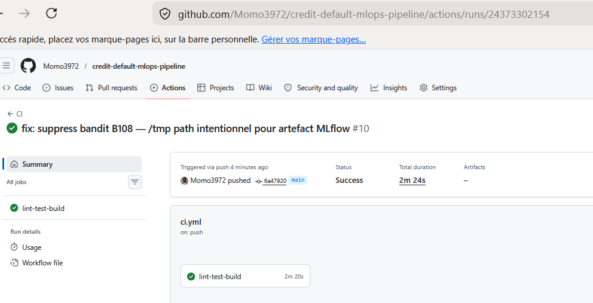
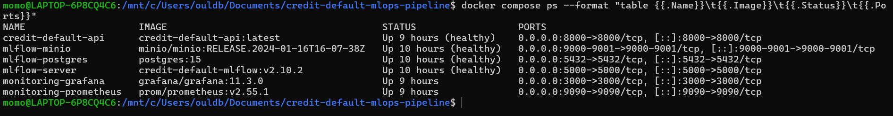
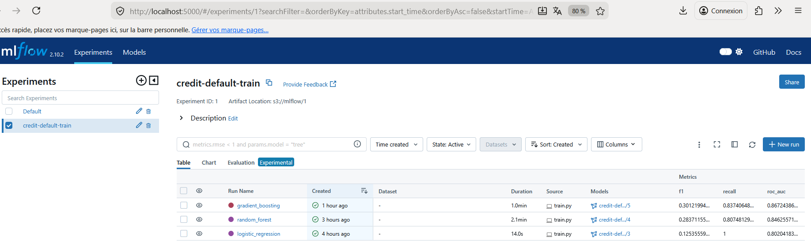
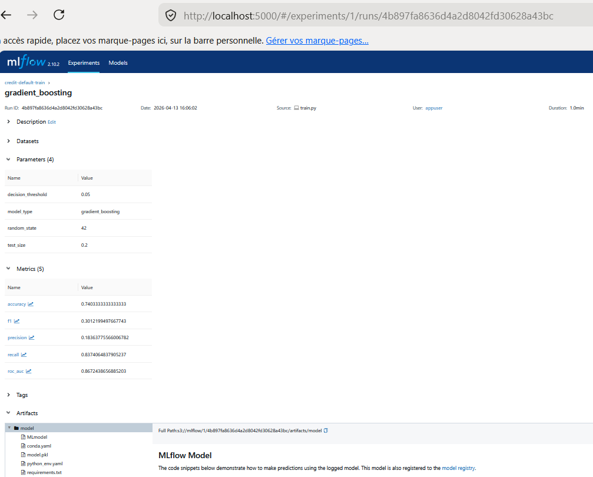
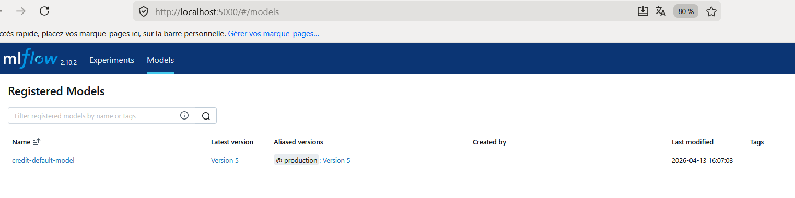
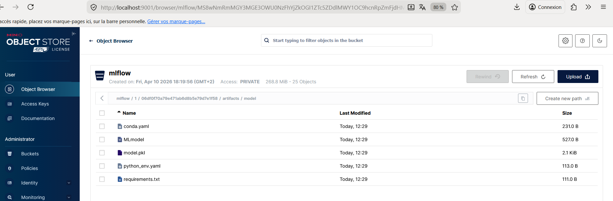
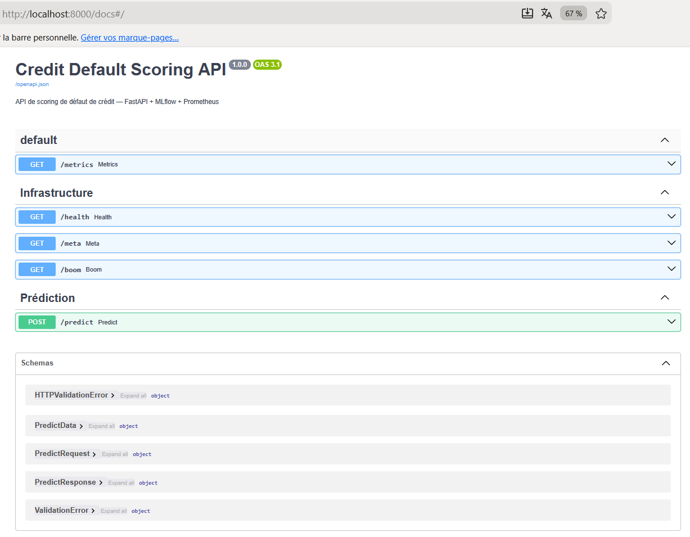
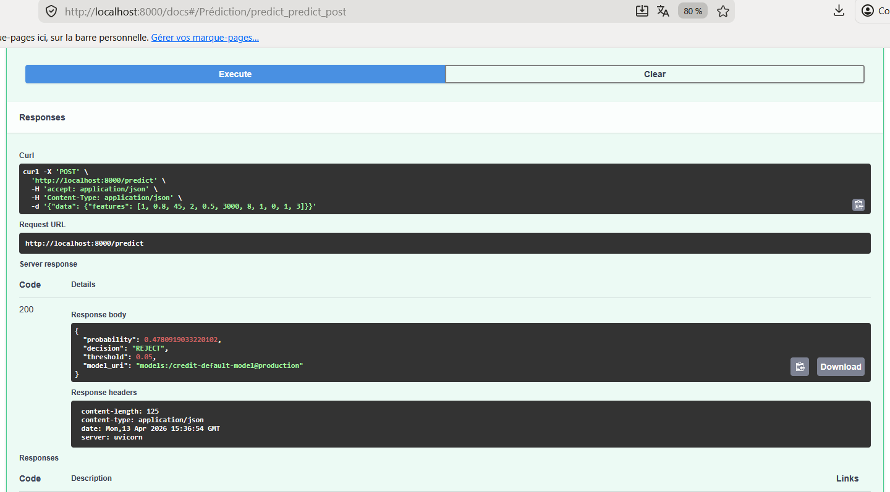
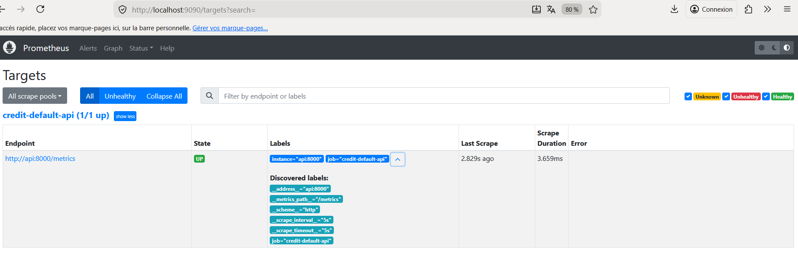
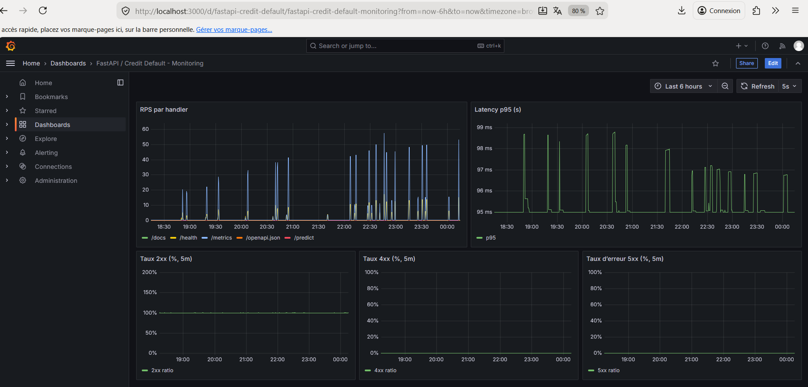

# Credit Default MLOps Pipeline

<p align="center">
  
  
  
  
  
  
  <a href="https://github.com/Momo3972/credit-default-mlops-pipeline/actions/workflows/ci.yml">
    
  </a>
  
</p>

Pipeline MLOps **production-ready** de scoring de défaut de crédit, couvrant l'intégralité du cycle de vie :
données → entraînement → tracking → registry → serving API → observabilité → CI/CD.

---

## Objectifs

Ce projet a pour but de démontrer la mise en œuvre complète d'un pipeline MLOps industriel, de la donnée brute jusqu'au serving en production, en suivant les standards de l'ingénierie logicielle moderne.

**Côté Data Science :** entraîner et comparer plusieurs algorithmes de classification (Régression Logistique, Random Forest, Gradient Boosting) sur le dataset *Give Me Some Credit* (Kaggle), versionner les expériences et promouvoir le meilleur modèle via MLflow Model Registry.

**Côté ingénierie :** exposer le modèle via une API REST FastAPI documentée (Swagger), containeriser l'ensemble de la stack avec Docker Compose (6 services), instrumenter l'API avec Prometheus et visualiser les métriques en temps réel dans Grafana.

**Côté DevOps :** automatiser la qualité du code (ruff), les tests unitaires (pytest + couverture), les scans de sécurité (bandit, pip-audit) et le build Docker via GitHub Actions CI/CD.

L'objectif final est un projet entièrement reproductible, documenté et déployable sur n'importe quelle machine disposant de Docker — adapté à un contexte de **stage / alternance en Data Engineering ou MLOps**.

---

## Architecture

```
┌─────────────────────────────────────────────────────────────────┐
│                         CLIENT / UTILISATEUR                     │
└──────────────────────────────┬──────────────────────────────────┘
                               │ HTTP POST /predict
                               ▼
┌──────────────────────────────────────────────────────────────────┐
│  FastAPI  :8000  (Python 3.11, Uvicorn 2 workers)                │
│  • GET  /health   → statut + model_uri                           │
│  • GET  /meta     → threshold, n_features, git_commit, version   │
│  • POST /predict  → probabilité de défaut + décision ACCEPT/REJECT│
│  • GET  /metrics  → métriques Prometheus (format text/plain)     │
│  • GET  /boom     → 500 volontaire (test observabilité)          │
└──────────┬───────────────────┬────────────────────────┬──────────┘
           │ load_model        │ /metrics               │
           ▼                   ▼                        ▼
┌──────────────────┐  ┌──────────────────┐  ┌──────────────────────┐
│  MLflow          │  │  Prometheus      │  │  Grafana             │
│  :5000           │  │  :9090           │  │  :3000               │
│  Tracking +      │  │  scrape 5s       │  │  Dashboard auto-     │
│  Model Registry  │  │                  │  │  provisionné         │
└──────┬───────────┘  └──────────────────┘  └──────────────────────┘
       │ artifacts            │ metrics
       ▼                      └────────────────────────┘
┌──────────────────┐
│  MinIO  :9000    │  ← S3-compatible, artefacts MLflow
│  Console :9001   │
└──────────────────┘
       │ metadata
       ▼
┌──────────────────┐
│  PostgreSQL :5432│  ← Backend store MLflow (runs, params, metrics)
└──────────────────┘
```

> Détail complet : [`docs/ARCHITECTURE.md`](docs/ARCHITECTURE.md)

---

## Stack technique

| Composant | Technologie | Rôle |
|---|---|---|
| Serving | FastAPI + Uvicorn | API REST de scoring |
| ML Tracking | MLflow 2.10.2 | Expériences, métriques, registry |
| Artifact store | MinIO (S3) | Stockage des modèles sérialisés |
| Metadata store | PostgreSQL 15 | Backend runs MLflow |
| Monitoring | Prometheus + Grafana | Métriques temps réel, dashboards |
| Containerisation | Docker + Compose | Reproductibilité totale |
| CI/CD | GitHub Actions | Lint, tests, sécurité, build |
| Qualité code | Ruff + pre-commit | Format, lint, hooks automatisés |
| Sécurité | pip-audit + bandit | Vulnérabilités dépendances + code |

---

## Démarrage rapide

### Pré-requis

- Docker Desktop (avec Docker Compose v2)
- Git
- Python 3.11+ *(optionnel — uniquement pour développement local hors Docker)*

### 1. Cloner le repo

```bash
git clone https://github.com/Momo3972/credit-default-mlops-pipeline.git
cd credit-default-mlops-pipeline
```

### 2. Configurer l'environnement

```bash
cp .env.example .env
# Les valeurs par défaut sont fonctionnelles pour un run local
```

### 3. Démarrer l'infrastructure (MLflow + MinIO + PostgreSQL)

```bash
docker compose up -d postgres minio mlflow
docker compose ps   # attendre que les 3 services soient "healthy"
```

### 4. Créer le bucket MinIO

Ouvrir http://localhost:9001 (login : `minio` / `minio123`)  
→ **Buckets** → **Create Bucket** → nom : `mlflow` → **Create**

### 5. Entraîner et comparer les algorithmes

`train.py` entraîne l'algorithme défini dans `configs/config.yaml`. Pour comparer plusieurs algorithmes, on exécute `train.py` une fois par algorithme en changeant la config — chaque exécution crée un run indépendant dans MLflow.

```bash
# Run 1 — Régression Logistique (config par défaut)
docker compose run --rm api python /app/train.py

# Run 2 — Random Forest
sed -i 's/type: logistic_regression/type: random_forest/' configs/config.yaml
docker compose run --rm -v $(pwd)/configs:/app/configs api python /app/train.py

# Run 3 — Gradient Boosting
sed -i 's/type: random_forest/type: gradient_boosting/' configs/config.yaml
docker compose run --rm -v $(pwd)/configs:/app/configs api python /app/train.py

# Restaurer la config par défaut
sed -i 's/type: gradient_boosting/type: logistic_regression/' configs/config.yaml
```

Résultats obtenus sur le dataset Give Me Some Credit (150 000 clients) :

| Algorithme | ROC AUC | Recall | F1 |
|---|---|---|---|
| Gradient Boosting | **0.8672** | 0.8374 | 0.3012 |
| Random Forest | 0.8463 | 0.8075 | 0.2837 |
| Logistic Regression | 0.8020 | 1.0000 | 0.1254 |

Les 3 runs sont visibles et comparables dans l'UI MLflow (http://localhost:5000).

### 6. Promouvoir le meilleur modèle en production

Gradient Boosting obtient le meilleur ROC AUC (0.8672) — c'est le modèle à promouvoir.

Dans l'UI MLflow (http://localhost:5000) :  
→ **Models** → `credit-default-model` → sélectionner la version Gradient Boosting → **Add/Edit Aliases** → `production` → **Save**

Ou via Makefile :
```bash
make promote
```

### 7. Lancer la stack complète

```bash
docker compose up -d
docker compose ps   # tous les services doivent être "healthy" ou "running"
```

### 8. Vérifier

```bash
curl http://localhost:8000/health
# {"status":"ok","model_uri":"models:/credit-default-model@production"}

curl http://localhost:8000/meta
# {"model_uri":"...","threshold":0.05,"n_features_expected":11,"git_commit":"...","model_version":"1"}
```

---

## Services exposés

| Service | URL | Credentials |
|---|---|---|
| API (Swagger) | http://localhost:8000/docs | — |
| MLflow UI | http://localhost:5000 | — |
| MinIO Console | http://localhost:9001 | `minio` / `minio123` |
| Prometheus | http://localhost:9090/targets | — |
| Grafana | http://localhost:3000 | `admin` / `admin1234!` |

---

## API — Référence

### `POST /predict`

Prédit la probabilité de défaut de crédit pour un client.

**Dataset source :** [Give Me Some Credit — Kaggle](https://www.kaggle.com/c/GiveMeSomeCredit)  
150 000 clients bancaires, 11 features, cible : `SeriousDlqin2yrs` (défaut dans les 90 jours).

**Features (ordre obligatoire) :**

| # | Nom | Description |
|---|---|---|
| 1 | *(index ligne)* | Identifiant de ligne du CSV |
| 2 | `RevolvingUtilizationOfUnsecuredLines` | Taux d'utilisation du crédit non sécurisé |
| 3 | `age` | Âge du client |
| 4 | `NumberOfTime30-59DaysPastDueNotWorse` | Retards 30-59 jours (derniers 2 ans) |
| 5 | `DebtRatio` | Ratio dette/revenu mensuel |
| 6 | `MonthlyIncome` | Revenu mensuel |
| 7 | `NumberOfOpenCreditLinesAndLoans` | Nombre de lignes de crédit ouvertes |
| 8 | `NumberOfTimes90DaysLate` | Retards > 90 jours |
| 9 | `NumberRealEstateLoansOrLines` | Prêts immobiliers |
| 10 | `NumberOfTime60-89DaysPastDueNotWorse` | Retards 60-89 jours |
| 11 | `NumberOfDependents` | Nombre de personnes à charge |

**Requête :**
```json
{
  "data": {
    "features": [1, 0.8, 45, 0, 0.3, 5000, 5, 0, 1, 0, 2]
  }
}
```

**Réponse :**
```json
{
  "probability": 0.453,
  "decision": "REJECT",
  "threshold": 0.05,
  "model_uri": "models:/credit-default-model@production"
}
```

> **Seuil de décision :** `0.05` (conservateur — maximise le recall pour ne pas manquer de défauts).  
> `REJECT` si `probability ≥ threshold`, `ACCEPT` sinon.

**Exemples curl :**

```bash
# Profil risqué → REJECT
curl -s -X POST http://localhost:8000/predict \
  -H "Content-Type: application/json" \
  -d '{"data":{"features":[1,0.8,45,2,0.5,3000,8,1,0,1,3]}}' | python3 -m json.tool

# Profil sain → ACCEPT (si probability < 0.05)
curl -s -X POST http://localhost:8000/predict \
  -H "Content-Type: application/json" \
  -d '{"data":{"features":[1,0.02,60,0,0.05,10000,2,0,1,0,0]}}' | python3 -m json.tool

# Sanity check
curl -s http://localhost:8000/health | python3 -m json.tool
curl -s http://localhost:8000/meta | python3 -m json.tool
```

---

## Entraînement — Multi-algorithmes

`train.py` compare automatiquement plusieurs algorithmes et enregistre le meilleur par ROC AUC :

| Algorithme | Configurable via `config.yaml` |
|---|---|
| `LogisticRegression` | `model.type: logistic_regression` |
| `RandomForestClassifier` | `model.type: random_forest` |
| `GradientBoostingClassifier` | `model.type: gradient_boosting` |
| Tous (comparaison) | `model.type: all` |

Pipeline sklearn : `SimpleImputer(median)` → `StandardScaler` → `Classifier(class_weight="balanced")`

```bash
# Entraîner (depuis l'host via Docker)
docker compose run --rm api python /app/train.py

# Évaluer le modèle en production
docker compose run --rm api python /app/evaluate.py

# Générer des prédictions batch
docker compose run --rm api python /app/predict.py
```

---

## CI/CD — GitHub Actions

Le workflow [`.github/workflows/ci.yml`](.github/workflows/ci.yml) s'exécute sur chaque push/PR :

```
Push → Checkout → Python 3.11 setup
         │
         ├── ruff format --check    (style)
         ├── ruff check             (lint)
         ├── pytest -q --cov        (tests unitaires + couverture)
         ├── codecov upload         (rapport couverture)
         ├── pip-audit              (vulnérabilités dépendances)
         ├── bandit                 (analyse statique sécurité)
         └── docker build           (validation image)
```

---

## Monitoring

### Prometheus
Scrape l'endpoint `GET /metrics` toutes les 5 secondes.  
Config : [`monitoring/prometheus/prometheus.yml`](monitoring/prometheus/prometheus.yml)

### Grafana
Dashboard **FastAPI / Credit Default — Monitoring** auto-provisionné :

| Panel | Métrique |
|---|---|
| RPS par handler | `http_requests_total` |
| Latence p95 | `http_request_duration_seconds` |
| Taux 2xx | Réponses HTTP 200-299 |
| Taux 4xx | Erreurs client |
| Taux 5xx | Erreurs serveur |

> Détail : [`docs/MONITORING.md`](docs/MONITORING.md)

---

## Structure du projet

```
credit-default-mlops-pipeline/
├── api.py                          # FastAPI — serving + métriques Prometheus
├── train.py                        # Entraînement multi-algorithmes + MLflow tracking
├── evaluate.py                     # Évaluation depuis le Model Registry
├── predict.py                      # Prédictions batch
├── Dockerfile                      # Multi-stage build (venv Python 3.11)
├── docker-compose.yml              # Stack complète (6 services)
├── docker-compose.monitoring.yml   # Monitoring seul (dev local hors Docker)
├── Makefile                        # Commandes opérationnelles (make help)
├── requirements.txt                # Dépendances production
├── requirements-dev.txt            # Dépendances développement
├── pyproject.toml                  # Config centralisée (ruff, pytest, coverage)
├── .pre-commit-config.yaml         # Hooks pre-commit (ruff + standards)
├── configs/
│   └── config.yaml                 # Configuration centralisée (data, model, mlflow)
├── infra/
│   └── mlflow/Dockerfile           # Image MLflow custom (psycopg2 + boto3)
├── monitoring/
│   ├── prometheus/prometheus.yml   # Config scraping
│   └── grafana/
│       ├── dashboards/fastapi.json # Dashboard JSON (auto-provisionné)
│       └── provisioning/           # Datasource + dashboard provider
├── tests/
│   ├── conftest.py                 # Fixtures pytest
│   ├── test_api.py                 # Tests unitaires FastAPI
│   └── test_api_integration.py    # Tests d'intégration (marker: integration)
├── docs/
│   ├── ARCHITECTURE.md             # Architecture détaillée + diagramme Mermaid
│   ├── MONITORING.md               # PromQL + dashboards
│   ├── USAGE.md                    # Runbook complet
│   └── Demo_Checklist.md           # Checklist de démo reproductible
└── data/
    ├── cs-training.csv             # Dataset Give Me Some Credit (150k lignes)
    └── cs-test.csv                 # Dataset de test
```

---

## Commandes Makefile

```bash
make help          # Liste toutes les commandes disponibles
make install       # Installation des dépendances (pip)
make lint          # Vérification ruff (format + lint)
make test          # Tests unitaires
make test-cov      # Tests avec rapport de couverture
make build         # Build Docker de l'image API
make up            # docker compose up -d (stack complète)
make down          # docker compose down
make train         # Lance train.py dans Docker
make promote       # Assigne l'alias @production au meilleur modèle
make logs          # Logs de l'API
make ps            # Statut des containers
```

---

## Notes techniques

**Pourquoi Python 3.11 et pas 3.12 ?**  
`mlflow==2.10.2` dépend de `pkg_resources` (module de `setuptools`). Dans `setuptools>=71` (publié en juillet 2024), `pkg_resources` a été supprimé du namespace top-level, rendant l'import impossible. Python 3.12 + pip moderne installe `setuptools>=71` par défaut. La solution : Python 3.11 + `setuptools>=69,<71` épinglé dans `requirements.txt`.

**Alias `@production` vs stage `/Production`**  
MLflow 2.x a déprécié les stages (`/Production`, `/Staging`). Ce projet utilise exclusivement les **aliases** (`@production`) : plus flexibles, non dépréciés, supportés dans `mlflow.sklearn.load_model("models:/model@alias")`.

**Healthcheck API sans curl**  
Les images `python:3.11-slim` n'incluent pas `curl`. Le healthcheck utilise `python -c "import urllib.request; urllib.request.urlopen(...)"` — stdlib uniquement, aucune dépendance externe.

---

## Résultats

Preuves d'exécution disponibles dans [`docs/assets/`](docs/assets/) :

|  |  |
|---|---|
| **CI/CD** — GitHub Actions : Tests &amp; Qualité + Build Docker | **Docker** — 6 services opérationnels |

|  |  |
|---|---|
| **MLflow** — historique des runs (3 algorithmes comparés) | **MLflow** — run détaillé (paramètres + métriques) |

|  |  |
|---|---|
| **MLflow Registry** — modèle `@production` assigné | **MinIO** — artefacts stockés (bucket `mlflow`) |

|  |  |
|---|---|
| **Swagger UI** — API auto-documentée | **Swagger** — réponse `POST /predict` en direct |

|  |  |
|---|---|
| **Prometheus** — target `credit-default-api` UP | **Grafana** — métriques temps réel (RPS, latence, erreurs) |

---

## Documentation

| Document | Contenu |
|---|---|
| [`DEMO_RAPIDE.md`](DEMO_RAPIDE.md) | Guide de démo complet — du clone au serving en production |
| [`docs/ARCHITECTURE.md`](docs/ARCHITECTURE.md) | Diagramme Mermaid, flux de données, choix techniques |
| [`docs/MONITORING.md`](docs/MONITORING.md) | PromQL, dashboards Grafana, alertes |
| [`docs/USAGE.md`](docs/USAGE.md) | Runbook pas-à-pas (local, Docker, debug) |
| [`docs/Demo_Checklist.md`](docs/Demo_Checklist.md) | Checklist de validation 100% reproductible |
| [`CHANGELOG.md`](CHANGELOG.md) | Historique des versions |

---

## Auteur

**Mohamed Lamine OULD BOUYA**  
Master Data Engineering / MLOps — Recherche de stage / alternance en France  
[GitHub](https://github.com/Momo3972) · [LinkedIn](https://www.linkedin.com/in/mohamedlamineouldbouya)
