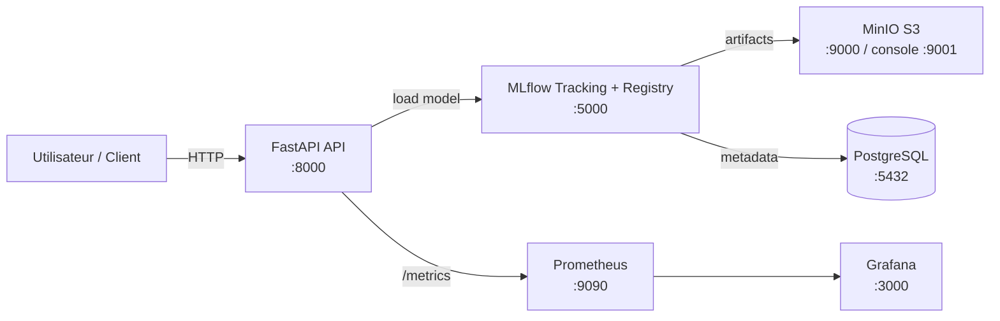

# Architecture MLOps

Ce document décrit l’architecture **end-to-end** du projet, alignée avec le code (`api.py`) et les fichiers Docker Compose.

## Vue d’ensemble

## Composants

### 1) FastAPI (serving)
- Fichier : `api.py`
- Ports : `8000:8000`
- Endpoints :
  - `GET /health` : statut + `model_uri`
  - `GET /meta` : metadata runtime (seuil, commit, version modèle si dispo)
  - `POST /predict` : prédiction (11 features)
  - `GET /metrics` : métriques Prometheus
  - `GET /boom` : 500 volontaire (test observabilité)

**Modèle :**
- chargé via MLflow : `mlflow.sklearn.load_model(MODEL_URI)`
- résolution de `MODEL_URI` :
  1. variable d’environnement `MODEL_URI`
  2. `configs/config.yaml` → `mlflow.model_uri`
  3. fallback `models:/credit-default-model@production`

### 2) MLflow (tracking + registry)
- `docker-compose.yml` → service `mlflow` (image `ghcr.io/mlflow/mlflow:v2.10.2`)
- Backend store : Postgres
- Artifact store : MinIO (S3)

L’API pointe sur MLflow via :
- `MLFLOW_TRACKING_URI=http://mlflow:5000`
- `MLFLOW_S3_ENDPOINT_URL=http://minio:9000`

### 3) MinIO (S3)
- Stocke les artefacts MLflow (`s3://mlflow/`)
- Console : `http://localhost:9001`

### 4) PostgreSQL
- Stocke les métadonnées MLflow (experiments, runs, registry…)

### 5) Prometheus
- Scrape la cible `api:8000` (dans le réseau docker)
- Config : `monitoring/prometheus/prometheus.yml`

### 6) Grafana
- Datasource : Prometheus
- Dashboards : provisionnés automatiquement au démarrage
  - provider : `monitoring/grafana/provisioning/dashboards/provider.yml`
  - dashboard : `monitoring/grafana/dashboards/fastapi.json`

## Flux de données (runtime)

1. Client appelle `POST /predict` avec 11 features.
2. L’API calcule `proba = model.predict_proba(...)[1]`.
3. Décision :
   - `REJECT` si `proba >= 0.05`
   - `ACCEPT` sinon
4. Toutes les requêtes alimentent les métriques Prometheus.
5. Prometheus scrappe `GET /metrics`, Grafana affiche RPS/latence/taux d’erreur.

## Points “production-ready” (à mettre en avant)
- Serving containerisé + ports fixes
- Registry & versioning modèle via MLflow
- Observabilité (latence p95, RPS, 4xx/5xx)
- CI automatisée (format/lint/tests/build)
