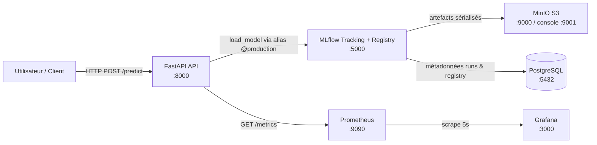

# Architecture MLOps

Ce document décrit l’architecture **end-to-end** du projet, alignée avec le code source (`api.py`) et la configuration Docker Compose.

## Vue d’ensemble


```mermaid
flowchart LR
  U[Utilisateur / Client] -->|HTTP POST /predict| API[FastAPI API<br/>:8000]
  API -->|load_model via alias @production| MLF[MLflow Tracking + Registry<br/>:5000]
  MLF -->|artefacts sérialisés| S3[MinIO S3<br/>:9000 / console :9001]
  MLF -->|métadonnées runs & registry| PG[(PostgreSQL<br/>:5432)]

  API -->|GET /metrics| PROM[Prometheus<br/>:9090]
  PROM -->|scrape 5s| GRAF[Grafana<br/>:3000]
```

## Composants

### 1. FastAPI (serving)

- Fichier : `api.py`
- Port exposé : `8000`
- Image : construite depuis `Dockerfile` (multi-stage, Python 3.11, venv isolé)
- Endpoints :
  - `GET /health` — statut du service + `model_uri` chargé
  - `GET /meta` — seuil de décision, nombre de features attendu, commit Git, version modèle
  - `POST /predict` — probabilité de défaut + décision ACCEPT/REJECT
  - `GET /metrics` — métriques Prometheus (format texte/plain)
  - `GET /boom` — erreur 500 volontaire (test observabilité)

Résolution de `MODEL_URI` (ordre de priorité) :
1. Variable d’environnement `MODEL_URI`
2. `configs/config.yaml` → `mlflow.model_uri`
3. Fallback : `models:/credit-default-model@production`

Le modèle en production est un **Gradient Boosting** (sklearn `GradientBoostingClassifier`) sélectionné après comparaison de 3 algorithmes sur le dataset Give Me Some Credit (150 000 clients) :

| Algorithme | ROC AUC | Recall | F1 |
|---|---|---|---|
| **Gradient Boosting** ← @production | **0.8672** | 0.8374 | 0.3012 |
| Random Forest | 0.8463 | 0.8075 | 0.2837 |
| Logistic Regression | 0.8020 | 1.0000 | 0.1254 |

### 2. MLflow (tracking + registry)

- Image : `infra/mlflow/Dockerfile` — image custom avec `mlflow==2.10.2`, `psycopg2-binary` (backend PostgreSQL) et `boto3` (artifact store MinIO/S3)
- Port exposé : `5000`
- Backend store : PostgreSQL (métadonnées des runs, paramètres, métriques)
- Artifact store : MinIO via protocole S3 (`s3://mlflow/`)
- Variables de connexion depuis `.env` : `MLFLOW_TRACKING_URI`, `MLFLOW_S3_ENDPOINT_URL`

### 3. MinIO (S3-compatible)

- Stocke les artefacts MLflow : modèles sérialisés pickle, fichiers de métadonnées
- Port API S3 : `9000` — Port console web : `9001`
- Bucket requis : `mlflow` (à créer manuellement avant le premier entraînement)

### 4. PostgreSQL

- Backend store MLflow : stocke experiments, runs, paramètres, métriques, registry
- Port : `5432`
- Credentials : définis dans `.env` (`POSTGRES_USER`, `POSTGRES_PASSWORD`, `POSTGRES_DB`)

### 5. Prometheus

- Scrape `GET /metrics` sur `api:8000` toutes les 5 secondes (réseau interne Docker)
- Port exposé : `9090`
- Config : `monitoring/prometheus/prometheus.yml`

### 6. Grafana

- Datasource Prometheus provisionné automatiquement au démarrage
- Dashboard **FastAPI / Credit Default — Monitoring** provisionné depuis `monitoring/grafana/dashboards/fastapi.json`
- Port exposé : `3000`
- Fichiers de provisioning : `monitoring/grafana/provisioning/`

## Flux de données (runtime)

```
Client
  │
  │ POST /predict { “data”: { “features”: [11 valeurs] } }
  ▼
FastAPI (api.py)
  │
  │ model.predict_proba(features)
  │     → proba = probabilité de défaut
  │     → décision: REJECT si proba ≥ 0.05, ACCEPT sinon
  │
  │ prometheus_instrumentator.expose()
  ▼
/metrics ──► Prometheus (scrape 5s) ──► Grafana (dashboard temps réel)
```

Le modèle est chargé **une seule fois au démarrage** de l’API via `mlflow.sklearn.load_model(MODEL_URI)`. L’alias `@production` dans MLflow Registry permet de changer de version sans redéployer l’API.

## Réseau Docker

Tous les services communiquent via le réseau `mlops-net` (bridge). Les ports sont exposés sur `localhost` uniquement pour le développement local.

## Décisions techniques notables

- **Python 3.11 + setuptools<71** : `mlflow==2.10.2` dépend de `pkg_resources`, retiré du namespace top-level dans `setuptools>=71` (juillet 2024). Pin explicite dans `requirements.txt`.
- **Alias `@production` vs stages** : MLflow 2.x a déprécié les stages (`/Production`). Le projet utilise exclusivement les aliases, plus flexibles et non dépréciés.
- **Healthcheck sans curl** : les images `python:3.11-slim` n’incluent pas curl. Le healthcheck utilise `python -c “import urllib.request; urllib.request.urlopen(...)”` (stdlib uniquement).
- **Multi-stage Dockerfile** : le builder installe les dépendances dans un venv isolé (`/venv`), le runtime ne copie que le venv — image finale sans outils de compilation.
